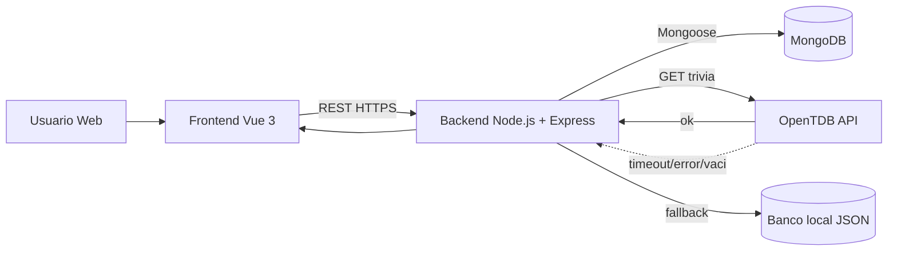

# DESIGN v0.2.0 - Proyecto Fathom's End (Edición Fullstack)

---

> **Registro de versión - 15/06/2026**
> Este documento es la evolución de [DESING.md](DESING.md) (v0.1, Solemne 2).
> La versión v0.2.0 integra la migración a arquitectura **fullstack** exigida en Solemne 3:
> backend propio, persistencia en base de datos, autenticación de usuarios, una nueva
> mecánica de juego ("El Oráculo del Mar") con integración a una API externa, y despliegue
> reproducible con Docker y CI/CD.
> Las especificaciones formales viven en [specs/002-fathoms-end-backend/](specs/002-fathoms-end-backend/).

---

## 1. Resumen y Evolución del Proyecto

Fathom's End nació en Solemne 2 como un roguelite 2D de un solo jugador, con combate por cartas,
exploración basada en decisiones y progresión dentro de cada partida. La versión **v0.2.0** mantiene
intacto ese núcleo de juego y lo envuelve en una **arquitectura fullstack** que agrega cuentas de
usuario, progreso permanente entre partidas y una nueva mecánica conectada a internet.

### 1.1 ¿Qué cambia respecto de la v0.1?

| Aspecto | Solemne 2 (v0.1) | Solemne 3 (v0.2) |
|---|---|---|
| **Arquitectura** | Solo frontend (SPA) | Frontend + API REST + Base de datos |
| **Persistencia** | Solo durante la sesión | Cuentas de usuario + mejoras permanentes + historial |
| **Autenticación** | No existe | Registro y login con JWT (24h) |
| **Mecánica nueva** | Combate, cartas, exploración | **El Oráculo del Mar** (evento de trivia) |
| **API externa** | Ninguna | Open Trivia Database (OpenTDB) + fallback local |
| **Autorización** | Ninguna | Owner (dueño) + Admin (solo lectura global) |
| **Despliegue** | Archivos estáticos | Docker Compose + GitHub Actions (CI/CD) |
| **Pruebas** | Vitest (frontend) | Vitest + pruebas de integración del backend |

### 1.2 Filosofía de la evolución

* El juego no se reescribe: el motor de combate, el sistema de cartas y la exploración por
  decisiones se conservan tal como quedaron en la v0.1.
* Todo lo nuevo se construye **alrededor** del juego: cuentas, persistencia y la mecánica del Oráculo.
* La regla de oro: ningún cambio puede empeorar la diversión, la claridad ni la rejugabilidad del núcleo.

---

## 2. Diseño del Juego (Núcleo - heredado de Solemne 2)

El bucle de juego no se modifica. Se resume aquí para dar contexto a las nuevas capas.

### 2.1 Concepto General

Fathom's End es un híbrido de construcción de mazos y acción 2D ambientado en un universo pirata.
El jugador navega un archipiélago generado proceduralmente, libra combates tácticos con cartas,
recolecta recompensas e intenta llegar al jefe final.

**Bucle principal:** Explorar isla → Combatir encuentros → Obtener recompensas → Progresar → Llegar al final.

### 2.2 Mecánicas Principales

* **Exploración:** mapa de islas (regulares, de jefe y de eventos) donde cada nodo dispara eventos
  narrativos con decisiones de probabilidades visibles.
* **Combate:** arena en tiempo real con patrones de ataque telegrafiados; el jugador usa cartas
  de acción (activas), pasivas (armas/armadura) y de utilidad (consumibles de exploración).
* **Progresión dentro de la partida:** derrotar jefes otorga oro, cartas y recompensas; los jefes
  principales entregan cartas únicas con efectos significativos.

### 2.3 Mejoras de la v0.1 aplicadas

Provenientes de las revisiones de Solemne 2 ([reviews](specs/001-fathoms-end-core/reviews/)):

| Punto revisado | Corrección aplicada |
|---|---|
| Validación de umbral de vida en `bosses.json` | Se eliminó el campo `hpThreshold` inválido según spec |
| Exclusividad de cartas de acción (crab_captain) | `salty_fist` queda exclusiva de `crab_captain` con validación en `Card.js` |
| Renderizado de zonas de colisión | Las zonas de PixiJS renderizan a 60 FPS de forma estable |
| Claridad del flujo de combate | Registro de turnos y retroalimentación visual mejorados |

---

## 3. Nueva Mecánica: El Oráculo del Mar

### 3.1 Concepto

Un oráculo místico que custodia los tesoros de las islas reta al jugador con una pregunta de trivia.
Una respuesta **correcta** otorga una recompensa legendaria; una respuesta **incorrecta** aplica daño.
Es la mecánica que conecta el juego con una API externa real.

### 3.2 Disparo y Probabilidad

* **Probabilidad base:** baja, configurable entre 10% y 25% por paso/evento (`ORACLE_BASE_PROBABILITY`).
* **Garantía por partida:** si no apareció por azar, se fuerza su aparición en o antes de un umbral
  configurable (`ORACLE_FORCE_AT_STEP`).
* **Trazabilidad:** el estado del Oráculo (`appeared`, `questionHash`, `result`) se persiste en la run
  para auditoría.

### 3.3 Fuente de las Preguntas

* **Primaria:** Open Trivia Database (OpenTDB), `GET /api.php?amount=1&type=multiple` (sin API key).
* **Fallback:** banco local en JSON (`backend/src/data/local-question-bank.json`) con preguntas de
  dificultades variadas, para que el jugador nunca quede bloqueado.
* **Normalización:** se decodifican entidades HTML, se barajan las opciones y se conserva categoría y
  dificultad. La respuesta correcta nunca se envía al frontend.

### 3.4 Evaluación e Idempotencia

* **Respuesta correcta** → recompensa legendaria garantizada.
* **Respuesta incorrecta** → penalización de daño.
* **Idempotencia:** se calcula un `questionHash` determinista y se usa un índice único
  `(runId, questionHash)`. Un reenvío de la misma respuesta devuelve `409 Conflict` sin volver a
  aplicar el efecto.

---

## 4. Arquitectura Fullstack

### 4.1 Diagrama del Sistema

**Flujo principal:**

1. El frontend autentica vía `/auth/register` y `/auth/login`.
2. El backend emite un JWT de 24h y protege los endpoints con middleware.
3. El progreso permanente se guarda en `profiles`; la trazabilidad de partidas en `game_runs`.
4. El Oráculo consume `/external/trivia/random` desde el backend (nunca directo a OpenTDB).
5. Si OpenTDB falla o no entrega preguntas, el backend usa el fallback local sin bloquear la partida.

### 4.2 Stack Tecnológico

#### Frontend (heredado de Solemne 2)

| Herramienta | Rol |
|---|---|
| **Vue.js 3 (Composition API)** | Pantallas, HUD reactivo, navegación y nuevas vistas de auth/perfil/Oráculo. |
| **PixiJS** | Motor de renderizado de combate a 60 FPS. |
| **Pinia** | Estado global reactivo del jugador (HP, mazo, oro, perfil). |
| **Vue Router** | Navegación entre pantallas, incluidas las rutas de autenticación. |
| **Vite** | Servidor de desarrollo (HMR) y empaquetador para producción. |
| **Vitest** | Pruebas unitarias y de integración del frontend. |

#### Backend (nuevo en Solemne 3)

| Herramienta | Rol |
|---|---|
| **Node.js 22 LTS** | Entorno de ejecución del servidor. |
| **Express 5** | Framework para la API REST. |
| **Mongoose 8** | ODM para modelar y consultar MongoDB. |
| **jsonwebtoken** | Generación y verificación de JWT. |
| **bcrypt** | Hash de contraseñas antes de persistir. |
| **zod / joi** | Validación de las peticiones entrantes. |
| **axios / fetch** | Cliente HTTP para consumir OpenTDB. |

#### Base de datos e Infraestructura

| Herramienta | Rol |
|---|---|
| **MongoDB 7** | Base de datos documental (usuarios, perfiles, runs, intentos del Oráculo). |
| **Docker + Docker Compose** | Contenerización y orquestación de frontend, backend y MongoDB. |
| **GitHub Actions** | Pipeline CI/CD: lint → test → build → push de imágenes a DockerHub. |
| **Nginx** | Servidor estático para el frontend en producción. |

---

## 5. Modelo de Datos (MongoDB)

Detalle formal en [specs/002-fathoms-end-backend/data-model.md](specs/002-fathoms-end-backend/data-model.md).

### 5.1 Colecciones

| Colección | Propósito |
|---|---|
| `users` | Identidad autenticable del jugador (email, hash de password, rol). |
| `profiles` | Estado persistente de progresión roguelite (mejoras: `damage`, `maxHp`, `speed`). |
| `game_runs` | Trazabilidad de partidas y estado del Oráculo por run. |
| `oracle_questions` | Preguntas normalizadas para uso interno. |
| `oracle_attempts` | Respuestas del jugador al Oráculo (con idempotencia). |
| `reward_ledger` | Registro de recompensas/penalizaciones aplicadas. |

### 5.2 Índices y Restricciones Clave

| Colección | Índice | Unicidad | Propósito |
|---|---|---|---|
| `users` | email | Único | Identificador de login |
| `profiles` | userId | Único | Relación 1:1 usuario-perfil |
| `game_runs` | (userId, startedAt) | Compuesto | Consulta de historial |
| `oracle_attempts` | (runId, questionHash) | Único | Garantía de idempotencia |

---

## 6. Contrato de la API REST

**Base:** `https://<host-backend>:<puerto>/`  ·  **Auth:** `Authorization: Bearer <JWT>`  ·  **Expiración:** 24h

Contrato OpenAPI: [specs/002-fathoms-end-backend/contracts/backend-api.yaml](specs/002-fathoms-end-backend/contracts/backend-api.yaml).

### 6.1 Endpoints del MVP

| Método | Ruta | Auth | Descripción |
|---|---|---|---|
| `POST` | `/auth/register` | Pública | Crea una cuenta local. |
| `POST` | `/auth/login` | Pública | Valida credenciales y entrega un JWT de 24h. |
| `GET` | `/profile/me` | Sí | Retorna el perfil del usuario autenticado (owner). |
| `PATCH` | `/profile/upgrades` | Sí + owner | Actualiza las mejoras persistentes permitidas. |
| `GET` | `/external/trivia/random` | Sí | Entrega una pregunta normalizada para el Oráculo. |
| `POST` | `/game/oracle/answer` | Sí | Valida la respuesta y devuelve recompensa/penalización. |
| `GET` | `/game/runs` | Sí + owner | Historial de partidas del propio usuario. |
| `PATCH` | `/game/runs/:runId/checkpoint` | Sí + owner | Guarda una partida en curso. |
| `GET` | `/game/runs/:runId/resume` | Sí + owner | Recupera una partida en curso. |

### 6.2 Endpoints de administración (solo lectura)

| Método | Ruta | Auth | Descripción |
|---|---|---|---|
| `GET` | `/admin/profiles` | Sí + admin | Lectura global de perfiles. |
| `GET` | `/admin/runs` | Sí + admin | Lectura global del historial de partidas. |

### 6.3 Códigos de error demostrables

* `401` no autenticado (sin token o token inválido/expirado).
* `403` no autorizado (intento de mutar recurso ajeno o de admin mutando datos).
* `409` respuesta del Oráculo duplicada (idempotencia).

---

## 7. Modelo de Seguridad

### 7.1 Autenticación (JWT)

* Algoritmo HS256, expiración fija de 24h, sin refresh token en el MVP.
* Payload: `{ sub: userId, email, role, iat, exp }`.
* El token se guarda en el frontend y se envía en la cabecera `Authorization: Bearer`.

### 7.2 Contraseñas

* Hash con bcrypt (`BCRYPT_SALT_ROUNDS`, recomendado 12) antes de persistir.
* El `passwordHash` nunca se expone en respuestas de la API.

### 7.3 Autorización (roles)

| Endpoint | Rol requerido | Alcance |
|---|---|---|
| `PATCH /profile/upgrades` | owner | Solo su propio perfil |
| `GET /admin/profiles` | admin | Global (solo lectura) |
| `GET /admin/runs` | admin | Global (solo lectura) |

> **Regla clave:** el rol admin es estrictamente de **lectura global**. Nunca puede mutar datos de terceros.

### 7.4 Endurecimiento adicional

* Validación de cada petición por esquema (zod/joi).
* Rate limiting en `/auth/register` y `/auth/login`.
* CORS restringido por `CORS_ORIGIN`.
* Logs sin exponer secretos ni hashes.

---

## 8. Integración con OpenTDB

### 8.1 Flujo de obtención

1. El frontend pide una pregunta al backend (nunca a OpenTDB directamente).
2. El backend intenta OpenTDB con timeout configurable (`OPENTDB_TIMEOUT_MS`).
3. Si responde bien → se normaliza y se devuelve con `source: opentdb`.
4. Si hay timeout, error o respuesta vacía → se usa el banco local con `source: local`.
5. Cada fallback se registra con su causa para auditoría.

### 8.2 Normalización

* Decodificación de entidades HTML (ej. `&quot;` → `"`).
* Barajado de las opciones (Fisher–Yates).
* La respuesta correcta se conserva **solo en el servidor** para validar; nunca viaja al frontend.

### 8.3 Banco de Fallback

* Ubicación: `backend/src/data/local-question-bank.json`.
* Contenido: preguntas con `question`, `correctAnswer`, `incorrectAnswers`, `category`, `difficulty`.
* Garantiza que una caída de OpenTDB nunca bloquee la partida.

---

## 9. Despliegue e Infraestructura

### 9.1 Docker

* **Frontend:** build con Vite servido por Nginx.
* **Backend:** imagen Node 22 (Express) con healthcheck.
* **MongoDB:** volumen persistente para los datos.

### 9.2 Docker Compose

Tres servicios orquestados en una red única (`frontend`, `backend`, `mongodb`), con healthchecks y
dependencia `backend → mongodb`. Se levanta con `docker compose up --build`.

### 9.3 CI/CD (GitHub Actions)

| Etapa | Acción |
|---|---|
| `lint` | Lint de frontend y backend. |
| `test` | Pruebas unitarias e integración. |
| `build` | Build de frontend y backend. |
| `docker` | Build y push de imágenes a DockerHub (solo en `main`/tags). |

> **Gate obligatorio:** el job de `build-push` depende de `lint-and-test`. Si fallan lint o tests,
> no se publican imágenes.

---

## 10. Estrategia de Pruebas

### 10.1 Backend

* **Unitarias:** servicios de auth (hash/compare, JWT), middlewares de roles/owner, servicio del
  Oráculo (normalización, fallback, evaluación correcta/incorrecta).
* **Integración:** registro/login + endpoint protegido, upgrades owner (200) vs tercero (403),
  admin lectura global (200) y mutación denegada (403), Oráculo correcto/incorrecto, doble submit
  (409) y caída de OpenTDB → fallback local.

### 10.2 Frontend

* Verificación de que el cliente consume solo la API propia para auth/perfil/Oráculo.
* Test específico para garantizar **cero llamadas directas** a OpenTDB.

### 10.3 Cobertura objetivo

* Cobertura ≥ 80% en módulos clave (auth, profile, oracle).
* 100% en rutas críticas: middleware de auth, validación de contraseña, guardas de rol e idempotencia del Oráculo.

---

## 11. Flujo de Desarrollo Local

Detalle completo en [specs/002-fathoms-end-backend/quickstart.md](specs/002-fathoms-end-backend/quickstart.md).

1. Instalar dependencias de frontend (`pnpm install`) y backend (`npm install`).
2. Configurar variables de entorno (`backend/.env`) según el quickstart.
3. Levantar MongoDB (local o contenedor Docker).
4. Iniciar backend (`npm run dev`) y frontend (`pnpm run dev`).
5. Alternativa todo-en-uno: `docker compose up --build`.

---

## 12. Demo y Cumplimiento de Rúbrica

### 12.1 Secuencia de evidencia

1. `POST /auth/register` exitoso.
2. `POST /auth/login` exitoso con token de 24h.
3. `GET /profile/me` sin token (401) y con token (200).
4. `PATCH /profile/upgrades` propio (200) y de tercero (403).
5. Admin: `GET /admin/profiles` y `GET /admin/runs` (200), mutación denegada (403).
6. Oráculo: pregunta autenticada, respuesta correcta (recompensa) y respuesta duplicada (409).
7. Simulación de OpenTDB caído → respuesta con `source=local`.
8. Pipeline CI verde y stack `docker-compose` operativo.

### 12.2 Mapeo a la rúbrica

| Requisito de rúbrica | Implementación |
|---|---|
| Arquitectura fullstack | Node.js + Express + MongoDB |
| Registro | `POST /auth/register` con bcrypt |
| Autenticación | JWT 24h + cabecera `Authorization` |
| Autorización | Roles owner/admin con guardas en middleware |
| Base de datos | MongoDB con colecciones y esquemas Mongoose |
| API externa | OpenTDB + fallback local |
| API REST | Endpoints del MVP + administración |
| Integración frontend | Vue 3 sin llamadas directas a OpenTDB |
| Docker | Dockerfiles + `docker-compose.yml` |
| CI/CD | GitHub Actions lint → test → build → push |
| Pruebas | Unitarias + integración (≥80% cobertura) |
| README | Instrucciones local/compose/DockerHub |

---

## 13. Estado y Próximos Pasos

* **Especificación 002:** estado `Ready` (spec, plan, tasks y data-model consistentes y validados).
* **Tareas:** 8 fases ejecutables en [specs/002-fathoms-end-backend/tasks.md](specs/002-fathoms-end-backend/tasks.md).
* **Siguiente acción sugerida:** iniciar la Fase 1 (preparación e inicialización del backend) siguiendo
  el orden de ejecución del MVP.
