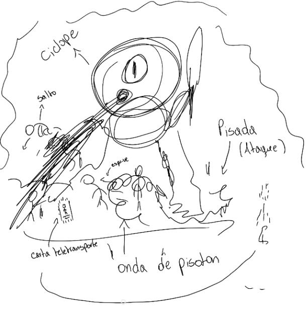

# Corsario - Proyecto Pirata

Juego web híbrido 2D que combina exploración de islas (RNG) con combates de acción estilo *bullet hell* y un sistema de cartas tácticas.

---

## 🎨 Imágenes de Concepto

A continuación se muestran las imágenes conceptuales que guían el diseño visual y de mecánicas del proyecto, organizadas en tres categorías.

---

### 🎭 Diseño
Bocetos y referencias visuales del estilo artístico del juego, incluyendo el concepto del enfrentamiento contra el Kraken.

---

### ⚔️ Combate
Arena de combate en tiempo real renderizada sobre HTML5 Canvas con sistema de cartas de Acción.

---

### 🗺️ Exploración
Mapa de islas basado en nodos donde cada isla dispara eventos por probabilidad (RNG): botín, cartas o peligros.

