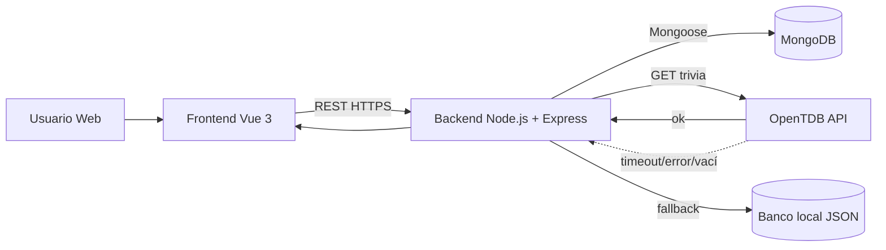

# Plan de Implementacion Tecnica: 002-fathoms-end-backend

**Rama**: `002-fathoms-end-backend` | **Fecha**: 2026-06-15 | **Spec**: [specs/002-fathoms-end-backend/spec.md](specs/002-fathoms-end-backend/spec.md)
**Entrada**: Especificacion funcional de `specs/002-fathoms-end-backend/spec.md`

## Resumen

Este plan define una entrega pragmatica para Solemne 3 que migra Fathom's End a arquitectura fullstack con backend propio, persistencia en MongoDB y mecanica del Oraculo integrada con API externa (OpenTDB) y fallback local. Se preservan decisiones acordadas: Node.js + Express + Mongoose, JWT access token 24h sin refresh token en MVP, auth local obligatoria, roles owner/admin con admin de solo lectura global, persistencia de upgrades (`damage`, `maxHp`, `speed`) y garantia de aparicion del Oraculo al menos una vez por run (configurable).

## Contexto Tecnico

**Lenguaje/Versión**: JavaScript (Node.js 22 LTS backend), Vue 3 frontend  
**Dependencias Principales**: Express 5, Mongoose 8, bcrypt, jsonwebtoken, zod/joi, axios/fetch  
**Almacenamiento**: MongoDB 7 + fallback local JSON para trivia  
**Pruebas**: Vitest, Supertest, pruebas de integracion con Mongo de pruebas  
**Plataforma Objetivo**: Contenedores Linux (Docker), desarrollo local Windows/Linux/macOS  
**Tipo de Proyecto**: Web app (SPA + API REST + DB)  
**Objetivos de Rendimiento**: p95 < 2s en auth/perfil bajo carga academica  
**Restricciones**: JWT unico 24h, admin de solo lectura, frontend sin llamadas directas a OpenTDB  
**Escala/Alcance**: Alcance Solemne 3, enfoque en robustez funcional y evidencia de rubrica

## Verificación de Constitución

*COMPUERTA: Debe aprobarse antes de la investigación de Fase 0. Reverificar tras el diseño de Fase 1.*

Estado: `PASS`.
1. Seguridad de boundaries cubierta: JWT obligatorio en endpoints protegidos + owner/admin en middleware dedicado.
2. Test-first cubierto por descomposicion en tasks con pruebas unitarias e integracion por endpoint.
3. Resiliencia externa cubierta: OpenTDB primario + fallback local obligatorio + trazabilidad de fallback.
4. Integridad/idempotencia cubierta: indice unico para intentos Oraculo y manejo 409 en doble submit.
5. Entrega reproducible cubierta: Docker Compose + CI con lint/test/build + smoke performance p95.

Re-check post-diseno:
1. Sin violaciones a los principios I-V de `.specify/memory/constitution.md`.
2. Gates de calidad definidos y trazables en spec/plan/tasks.

## 1) Visión General de la Arquitectura



Flujo principal:
1. Frontend autentica por `/auth/register` y `/auth/login`.
2. Backend emite JWT 24h y protege endpoints con middleware.
3. Persistencia de progreso en `profiles`, trazabilidad de runs en `game_runs`.
4. Oraculo consume `/external/trivia/random` desde backend (no directo a OpenTDB).
5. Si OpenTDB falla/vacio, backend usa fallback local sin bloquear partida.

## 2) Estructura Propuesta Backend

```text
backend/
  src/
    app.js
    server.js
    config/
      env.js
      db.js
      logger.js
    modules/
      auth/
      profile/
      game/
      oracle/
      admin/
    models/
      User.js
      Profile.js
      GameRun.js
      OracleAttempt.js
      RewardLedger.js
    integrations/
      opentdb.client.js
      trivia.normalizer.js
      trivia.fallback.repository.js
    middleware/
      authJwt.js
      requireRole.js
      ownerScope.js
      errorHandler.js
      requestId.js
    data/
      local-question-bank.json
  tests/
    unit/
    integration/
    contract/
```

Decision de estructura:
1. Backend en carpeta dedicada para desacoplar frontend y facilitar CI/CD.
2. Modulos por dominio para iterar por fases y testear por feature.

## 3) Modelo de Datos MongoDB

Detalle formal: [specs/002-fathoms-end-backend/data-model.md](specs/002-fathoms-end-backend/data-model.md)

Colecciones:
1. `users`
2. `profiles`
3. `game_runs`
4. `oracle_questions`
5. `oracle_attempts`
6. `reward_ledger`

Indices/constraints clave:
1. `users.email` unique.
2. `profiles.userId` unique (1:1 user-profile).
3. `oracle_attempts(runId, questionHash)` unique para idempotencia.
4. Validacion de upgrades con min/max en schema.
5. Admin lectura global, sin mutaciones.

## 4) Diseño de la API (Contrato de Endpoints)

Contrato OpenAPI: [specs/002-fathoms-end-backend/contracts/backend-api.yaml](specs/002-fathoms-end-backend/contracts/backend-api.yaml)

Endpoints MVP reflejados del spec:
1. `POST /auth/register`
2. `POST /auth/login`
3. `GET /profile/me` (auth)
4. `PATCH /profile/upgrades` (auth + owner)
5. `GET /external/trivia/random` (auth)
6. `POST /game/oracle/answer` (auth)
7. `GET /game/runs` (auth + owner)
8. `PATCH /game/runs/:runId/checkpoint` (auth + owner)
9. `GET /game/runs/:runId/resume` (auth + owner)

Soporte admin de solo lectura:
1. `GET /admin/profiles`
2. `GET /admin/runs`

Shapes clave:
1. Auth: `{ accessToken, expiresIn: "24h", user }`
2. Profile: `{ userId, upgrades: { damage, maxHp, speed }, updatedAt }`
3. Trivia: `{ runId, questionHash, source, question, options, category, difficulty }` sin `correctAnswer` en payload al frontend
4. Oracle result: `{ isCorrect, effect, appliedAt }`
5. Checkpoint: `{ runId, step, hp, deckState, oracleState, updatedAt }`

Codigos de error demostrables:
1. `401` no autenticado.
2. `403` no autorizado.
3. `409` respuesta Oraculo duplicada.

## 5) Plan de Seguridad

1. Hash de password con bcrypt (`BCRYPT_SALT_ROUNDS`, recomendado 12).
2. JWT access token firmado con `JWT_SECRET` y expiracion fija `24h`.
3. Middleware `authJwt` en todos los endpoints protegidos.
4. Guardas `requireRole('admin')` y `ownerScope` para enforcement owner/admin.
5. Validacion de request en capa schema (zod/joi).
6. Rate limiting en login/registro.
7. CORS restringido por `CORS_ORIGIN`.
8. Logs sin exponer secretos ni hashes.

## 6) Plan de Integracion Oraculo

Normalizacion:
1. OpenTDB -> DTO interno uniforme (`question`, `correctAnswer`, `incorrectAnswers`).
2. Decode de HTML entities y barajado de opciones.

Fallback:
1. Timeout OpenTDB configurable (`OPENTDB_TIMEOUT_MS`).
2. Fallback local por timeout/error/response vacia.
3. Campo `source` en respuesta para trazabilidad.

Idempotencia:
1. `questionHash` deterministico por pregunta normalizada.
2. Unique index `(runId, questionHash)` en `oracle_attempts`.
3. Reenvio de respuesta retorna `409` sin re-aplicar efecto.

Garantia por run:
1. Probabilidad baja por paso/evento (`ORACLE_BASE_PROBABILITY`).
2. Forzado al umbral (`ORACLE_FORCE_AT_STEP`) si aun no aparecio.
3. Persistencia de `oracle.appeared` en run para auditoria.

## 7) Plan de Testing

Backend unit:
1. Auth service (hash/compare, JWT sign/verify).
2. Middleware auth/roles/owner.
3. Oracle service (normalizacion, fallback, evaluacion correcta/incorrecta).

Backend integration:
1. Register/login y endpoint protegido.
2. Upgrades owner OK y tercero 403.
3. Admin lectura global 200 y mutacion 403.
4. Oraculo correcta -> `legendaryReward`.
5. Oraculo incorrecta -> `damagePenalty`.
6. Doble submit -> `409`.
7. OpenTDB caido -> fallback local.

Frontend API checks:
1. Verificar que cliente usa API propia para auth/profile/oraculo.
2. Test para evitar llamadas directas a OpenTDB.

## 8) Estrategia Docker + Compose

Servicios:
1. `frontend` (build Vite + Nginx).
2. `backend` (Node/Express).
3. `mongodb` (volumen persistente).

Reglas de orquestacion:
1. Red compose unica.
2. Healthchecks en backend/mongodb.
3. Dependencia backend -> mongodb.

## 9) Estrategia CI/CD

Pipeline recomendado:
1. `lint` frontend + backend.
2. `test` unit + integration.
3. `build` frontend + backend.
4. `docker` build/push imagenes frontend/backend a DockerHub en `main` o tags.

Gates:
1. Merge bloqueado si falla lint/test/build.
2. Publish Docker bloqueado si falla suite de seguridad funcional.

## 10) Fases, Hitos y Verificaciones de Aceptación

Fase A (P1) - Auth y seguridad base:
1. Registro/login + JWT 24h + middleware auth.
2. Check: 401 sin token, 200 con token en endpoint protegido.

Fase B (P1) - Persistencia y roles:
1. Upgrades persistentes + owner/admin enforcement.
2. Check: owner solo muta propio, admin solo lectura global.

Fase C (P1) - Oraculo resiliente:
1. Trivia OpenTDB + fallback + answer idempotente.
2. Check: reward/penalty correctos y 409 en doble submit.

Fase D (P2) - Historial, Docker, CI/CD:
1. Auditoria runs + compose + pipeline verde.
2. Check: stack levantable y evidencia de CI.

Fase E (P2) - Demo rubricable:
1. Script de demostracion completo de FR/SC.
2. Check: cumplimiento visible sin bypass manual.

## Riesgos y Mitigaciones

1. OpenTDB inestable.
- Mitigacion: timeout corto + fallback local + logging de causa.
2. Errores de autorizacion.
- Mitigacion: middleware centralizado + matriz de tests 401/403.
3. Doble aplicacion de efectos Oraculo.
- Mitigacion: unique index + manejo de conflicto 409.
4. Desalineacion frontend/backend de contrato.
- Mitigacion: OpenAPI versionado + checks de integracion.
5. Tiempo acotado Solemne 3.
- Mitigacion: priorizar fases A-C; Google login queda stretch goal.

## Variables de Entorno Concretas

Backend:
1. `NODE_ENV`
2. `PORT`
3. `MONGODB_URI`
4. `JWT_SECRET`
5. `JWT_EXPIRES_IN=24h`
6. `BCRYPT_SALT_ROUNDS`
7. `CORS_ORIGIN`
8. `LOG_LEVEL`
9. `OPENTDB_BASE_URL`
10. `OPENTDB_TIMEOUT_MS`
11. `ORACLE_FALLBACK_PATH`
12. `ORACLE_BASE_PROBABILITY`
13. `ORACLE_FORCE_AT_STEP`
14. `ORACLE_LOW_PROB_MODE`

Compose:
1. `COMPOSE_PROJECT_NAME`
2. `FRONTEND_PORT`
3. `BACKEND_PORT`
4. `MONGODB_PORT`
5. `MONGO_INITDB_DATABASE`

## Como Probar Cumplimiento de Rubrica en Demo

Secuencia de evidencia:
1. `POST /auth/register` exitoso.
2. `POST /auth/login` exitoso con token 24h.
3. `GET /profile/me` sin token (401) y con token (200).
4. `PATCH /profile/upgrades` owner propio (200), ajeno (403).
5. Admin: `GET /admin/profiles` y `GET /admin/runs` (200), mutacion denegada (403).
6. Oraculo:
- `GET /external/trivia/random` con auth.
- `POST /game/oracle/answer` correcta (legendaryReward).
- `POST /game/oracle/answer` duplicada (409).
7. Simulacion OpenTDB caido y respuesta con `source=local`.
8. Mostrar pipeline CI verde y stack docker-compose operativo.

## Estructura del Proyecto

### Documentación (funcionalidad 002)

```text
specs/002-fathoms-end-backend/
├── plan.md
├── research.md
├── data-model.md
├── quickstart.md
├── contracts/
│   └── backend-api.yaml
└── tasks.md  # se genera en speckit.tasks
```

### Código Fuente (raíz del repositorio)

```text
src/          # frontend existente
tests/        # pruebas existentes frontend/engine
backend/      # backend propuesto para esta feature
```

**Decisión de Estructura**: arquitectura web fullstack con backend separado para facilitar entrega incremental, pruebas de integracion y despliegue reproducible.

## Complejidad y Justificacion

No se registran violaciones que requieran excepcion formal en esta fase de planificacion.
